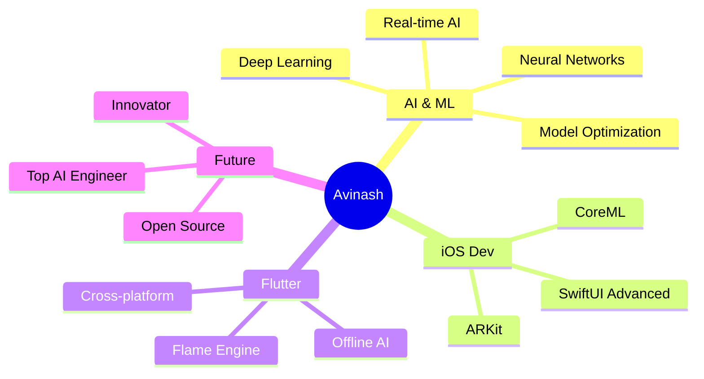
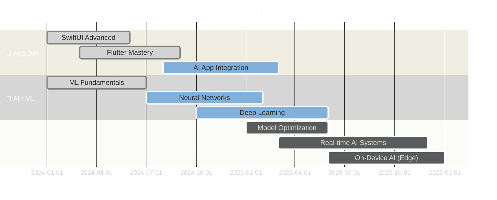
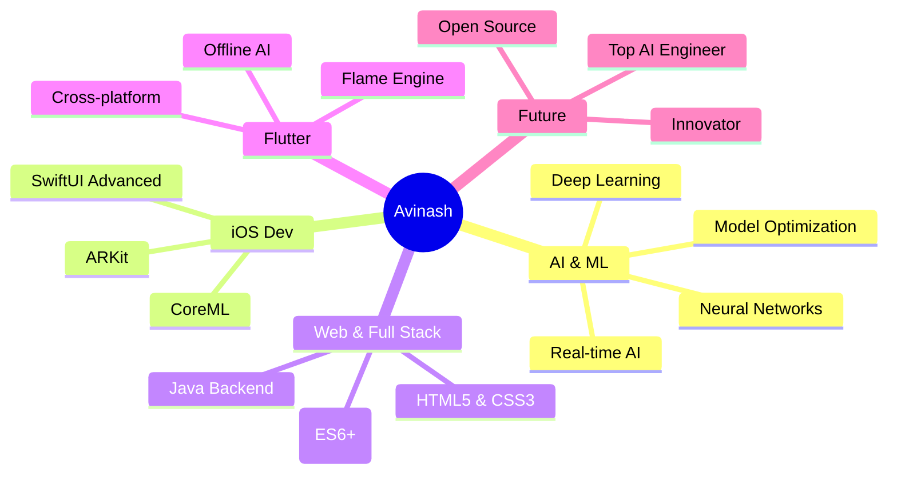

<div align="center">

<!-- ANIMATED BANNER -->


<!-- TYPING ANIMATION -->


<br/>

<!-- PROFILE VIEWS + FOLLOWERS BADGES -->

&nbsp;


</div>

---

<div align="center">

## 🌌 `> whoami`

</div>

```yaml
Name      : Avinash Pandey
Role      : AI Developer | iOS Developer | Flutter Developer
Mission   : Build AI-powered apps that change how people live
Location  : India 🇮🇳
Status    : Building something extraordinary 🚀
Currently : SwiftUI + ChatGPT AI App | AI Photo Editor | ML Models
Goal      : Top AI Engineer + Innovator
Fun Fact  : I love creating things that don't exist yet ⚡
```

---

<div align="center">

## 🎨 Tech Universe

</div>

<table align="center">
<tr>
<td valign="top" width="33%">

### 👨‍💻 Languages
<div align="center">


</div>
</td>
<td valign="top" width="33%">

### 📱 App Dev
<div align="center">


</div>
</td>
<td valign="top" width="33%">

### 🤖 AI / ML
<div align="center">


</div>
</td>
</tr>
</table>

<div align="center">

### 🛠 Tools & Platforms


</div>

---

<div align="center">

## 🚀 Featured Projects

</div>

<table align="center">
<tr>

<td width="50%" valign="top">

### ✈️ Flight Booking iOS App
> *Modern iOS experience, built with Swift*

```
📌 Platform   → iOS (Swift + SwiftUI)
🎨 UI Style   → Clean, minimal, modern
⚙️  Feature   → Real-time booking interface
✨ Highlight  → Smooth UX & intuitive flow
```

[]()
[]()

</td>

<td width="50%" valign="top">

### 🤖 ChatGPT-Style AI App
> *Conversational AI, built from scratch*

```
📌 Platform   → iOS (SwiftUI)
🧠 Engine     → OpenAI API Integration
💬 Feature   → Real-time AI chat system
✨ Highlight  → Responsive & fluid UI
```

[]()
[]()

</td>

</tr>
<tr>

<td width="50%" valign="top">

### 🎨 AI Photo Editing App
> *Offline AI image enhancement*

```
📌 Platform   → Flutter (Cross-platform)
🖼️ Features  → Enhance, Denoise, Restore
⚡ Processing → 100% Offline AI
✨ Highlight  → On-device neural models
```

[]()
[]()

</td>

<td width="50%" valign="top">

### 🧠 ML Research Projects
> *Exploring deep learning frontiers*

```
📌 Domain     → Neural Networks & DL
📊 Focus      → Model optimization
🔬 Learning  → Advanced AI/ML Systems
✨ Goal       → Real-time AI apps
```

[]()
[]()

</td>

</tr>
</table>

---

<div align="center">

## 📊 GitHub Stats


<br/>


</div>

---

<div align="center">

## 🏆 GitHub Trophies


</div>

---

<div align="center">

## 🧠 Currently Leveling Up

</div>



---

<div align="center">

## 📈 Contribution Activity


</div>

---

<div align="center">

## 🌐 Let's Connect & Build Together

<a href="https://www.linkedin.com/in/avinashpandeyai/">
  
</a>
&nbsp;
<a href="https://www.instagram.com/mr.avi_pandey/">
  
</a>
&nbsp;
<a href="https://github.com/avinash9354">
  
</a>
&nbsp;
<a href="mailto:avinash9354@email.com">
  
</a>

<br/><br/>

---

### 💜 Support My Work

<a href="https://www.buymeacoffee.com/avinash9354">
  
</a>

<br/><br/>

---


<br/>

<!-- FOOTER WAVE -->


</div>


<div align="center">

<!-- ████████████████████ CINEMATIC HEADER ████████████████████ -->


<br/>

[](https://git.io/typing-svg)

<br/>


&nbsp;

&nbsp;


</div>

---

<!-- ████████████████████ ABOUT ME ████████████████████ -->

<div align="center">
<h2>🌌 <code>whoami --verbose</code></h2>
</div>

<table>
<tr>
<td width="60%">

```typescript
const avinash = {
  name      : "Avinash Pandey",
  title     : "AI Developer & Future ML Engineer",
  location  : "India 🇮🇳",
  building  : [
    "ChatGPT-Style AI App (SwiftUI)",
    "AI Photo Editing App (Flutter)",
    "Offline Neural Image Processor",
  ],
  learning  : [
    "Deep Learning",
    "Neural Networks",
    "Real-time AI Inference",
    "Model Optimization",
  ],
  superpower: "I build things that don't exist yet ⚡",
  goal      : "Top AI Engineer + Global Innovator 🚀",
  openTo    : ["Collabs", "AI Projects", "Open Source"],
};
```

</td>
<td width="40%" align="center">


</td>
</tr>
</table>

---

<!-- ████████████████████ TECH ARSENAL ████████████████████ -->

<div align="center">
<h2>⚔️ Tech Arsenal</h2>
</div>

<details open>
<summary><b>🟣 Languages — The Weapons of Choice</b></summary>
<br/>
<div align="center">


</div>
</details>

<details open>
<summary><b>🔵 Frameworks & Platforms</b></summary>
<br/>
<div align="center">


</div>
</details>

<details open>
<summary><b>🤖 AI / ML Stack</b></summary>
<br/>
<div align="center">


</div>
</details>

<details open>
<summary><b>🛠 Dev Tools</b></summary>
<br/>
<div align="center">


</div>
</details>

---

<!-- ████████████████████ FEATURED PROJECTS ████████████████████ -->

<div align="center">
<h2>🏗️ Flagship Projects</h2>
<p><i>Every line of code is a step toward the future</i></p>
</div>

<table>
<tr>
<td width="50%">

### ✈️ Flight Booking iOS App
> *Real-world iOS product with premium UX*

| | |
|---|---|
| 🍏 **Platform** | iOS (Swift + SwiftUI) |
| 🎨 **Style** | Modern, Clean UI |
| ⚡ **Feature** | Real-time booking flow |
| 🏆 **Highlight** | Smooth animations & UX |


</td>
<td width="50%">

### 🤖 ChatGPT-Style AI App
> *Full AI chat experience on iOS*

| | |
|---|---|
| 🍏 **Platform** | iOS (SwiftUI) |
| 🧠 **Engine** | OpenAI API |
| 💬 **Feature** | Real-time streaming chat |
| 🏆 **Highlight** | Fluid & responsive UI |


</td>
</tr>
<tr>
<td width="50%">

### 🎨 AI Photo Editing App
> *On-device AI — no internet needed*

| | |
|---|---|
| 📱 **Platform** | Flutter (Cross-platform) |
| 🖼️ **Features** | Enhance · Denoise · Restore |
| ⚡ **Processing** | 100% Offline AI |
| 🏆 **Highlight** | Neural model on-device |


</td>
<td width="50%">

### 🧠 Deep Learning Research
> *Exploring the frontiers of AI*

| | |
|---|---|
| 🔬 **Domain** | Neural Networks & DL |
| 📊 **Focus** | Model optimization |
| 🧪 **Learning** | Advanced AI/ML systems |
| 🏆 **Goal** | Real-time AI applications |


</td>
</tr>
</table>

---

<!-- ████████████████████ STATS ████████████████████ -->

<div align="center">
<h2>📊 GitHub Stats Universe</h2>


&nbsp;&nbsp;


<br/><br/>


</div>

---

<!-- ████████████████████ TROPHIES ████████████████████ -->

<div align="center">
<h2>🏆 Trophy Room</h2>


</div>

---

<!-- ████████████████████ ROADMAP ████████████████████ -->

<div align="center">
<h2>🧠 AI Engineering Roadmap</h2>
</div>



---

<!-- ████████████████████ SKILL METERS ████████████████████ -->

<div align="center">
<h2>⚡ Skill Power Levels</h2>
</div>

```
Swift / SwiftUI      ████████████████████░   95%  🔥 Expert
Flutter / Dart       ███████████████████░░   90%  🔥 Expert
Python (AI/ML)       ████████████████░░░░░   80%  ⚡ Advanced
C / C++              ███████████████░░░░░░   75%  ⚡ Advanced
Firebase             ████████████████░░░░░   80%  ⚡ Advanced
TensorFlow / Keras   ████████████░░░░░░░░░   60%  📈 Growing
PyTorch              ██████████░░░░░░░░░░░   50%  📈 Growing
Deep Learning        █████████░░░░░░░░░░░░   45%  🎯 Learning
```

---

<!-- ████████████████████ SNAKE ████████████████████ -->

<div align="center">
<h2>🐍 Watch My Contributions Get Eaten</h2>

<picture>
  <source media="(prefers-color-scheme: dark)" srcset="https://raw.githubusercontent.com/avinash9354/avinash9354/output/github-snake-dark.svg"/>
  <source media="(prefers-color-scheme: light)" srcset="https://raw.githubusercontent.com/avinash9354/avinash9354/output/github-snake.svg"/>
  
</picture>

</div>

---

<!-- ████████████████████ CONNECT ████████████████████ -->

<div align="center">
<h2>🌐 Let's Connect • Collaborate • Create</h2>
<p><i>Open for AI collaborations, projects & innovative ideas 🚀</i></p>

<a href="https://www.linkedin.com/in/avinashpandeyai/">
  
</a>
&nbsp;
<a href="https://www.instagram.com/mr.avi_pandey/">
  
</a>
&nbsp;
<a href="https://github.com/avinash9354">
  
</a>
&nbsp;
<a href="mailto:avinash9354@gmail.com">
  
</a>

<br/><br/>

<a href="https://www.buymeacoffee.com/avinash9354">
  
</a>

</div>

---

<!-- ████████████████████ SIGNATURE ████████████████████ -->

<div align="center">

<br/>

> ### *"I don't just use technology —*
> ### *I build it to change the future."*
> #### — **Avinash Pandey** ⚡

<br/>


</div>


<div align="center">

<!-- ANIMATED BANNER -->


<!-- TYPING ANIMATION -->


<br/>

<!-- PROFILE VIEWS + FOLLOWERS BADGES -->

&nbsp;


</div>

---

<div align="center">

## 🌌 `> whoami`

</div>

```yaml
Name      : Avinash Pandey
Role      : AI Developer | iOS Developer | Flutter Developer | Full Stack
Mission   : Build AI-powered apps that change how people live
Location  : India 🇮🇳
Status    : Building something extraordinary 🚀
Currently : SwiftUI + ChatGPT AI App | AI Photo Editor | ML Models
Goal      : Top AI Engineer + Innovator
Fun Fact  : I love creating things that don't exist yet ⚡
```

---

<div align="center">

## 🎨 Tech Universe

</div>

<table align="center">
<tr>
<td valign="top" width="33%">

### 👨‍💻 Languages
<div align="center">


</div>
</td>
<td valign="top" width="33%">

### 📱 App Dev
<div align="center">


</div>
</td>
<td valign="top" width="33%">

### 🤖 AI / ML
<div align="center">


</div>
</td>
</tr>
</table>

<div align="center">

### 🛠 Tools & Platforms


</div>

---

<div align="center">

## 🚀 Featured Projects

</div>

<table align="center">
<tr>

<td width="50%" valign="top">

### ✈️ Flight Booking iOS App
> *Modern iOS experience, built with Swift*

```
📌 Platform   → iOS (Swift + SwiftUI)
🎨 UI Style   → Clean, minimal, modern
⚙️  Feature   → Real-time booking interface
✨ Highlight  → Smooth UX & intuitive flow
```

[]()
[]()

</td>

<td width="50%" valign="top">

### 🤖 ChatGPT-Style AI App
> *Conversational AI, built from scratch*

```
📌 Platform   → iOS (SwiftUI)
🧠 Engine     → OpenAI API Integration
💬 Feature   → Real-time AI chat system
✨ Highlight  → Responsive & fluid UI
```

[]()
[]()

</td>

</tr>
<tr>

<td width="50%" valign="top">

### 🎨 AI Photo Editing App
> *Offline AI image enhancement*

```
📌 Platform   → Flutter (Cross-platform)
🖼️ Features  → Enhance, Denoise, Restore
⚡ Processing → 100% Offline AI
✨ Highlight  → On-device neural models
```

[]()
[]()

</td>

<td width="50%" valign="top">

### 🧠 ML Research Projects
> *Exploring deep learning frontiers*

```
📌 Domain     → Neural Networks & DL
📊 Focus      → Model optimization
🔬 Learning  → Advanced AI/ML Systems
✨ Goal       → Real-time AI apps
```

[]()
[]()

</td>

</tr>
</table>

---

<div align="center">

## 📊 GitHub Stats


<br/>


</div>

---

<div align="center">

## 🏆 GitHub Trophies


</div>

---

<div align="center">

## 🧠 Currently Leveling Up

</div>



---

<div align="center">

## 📈 Contribution Activity


</div>

---

<div align="center">

## 🌐 Let's Connect & Build Together

<a href="https://www.linkedin.com/in/avinashpandeyai/">
  
</a>
&nbsp;
<a href="https://www.instagram.com/mr.avi_pandey/">
  
</a>
&nbsp;
<a href="https://github.com/avinash9354">
  
</a>
&nbsp;
<a href="mailto:avinash9354@email.com">
  
</a>

<br/><br/>

---

### 💜 Support My Work

<a href="https://www.buymeacoffee.com/avinash9354">
  
</a>

<br/><br/>

---


<br/>

<!-- FOOTER WAVE -->


</div>

